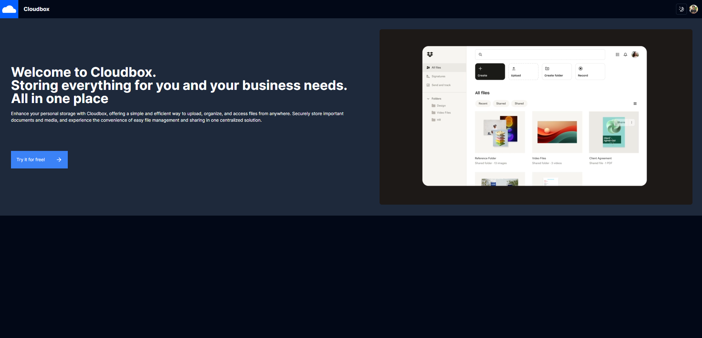
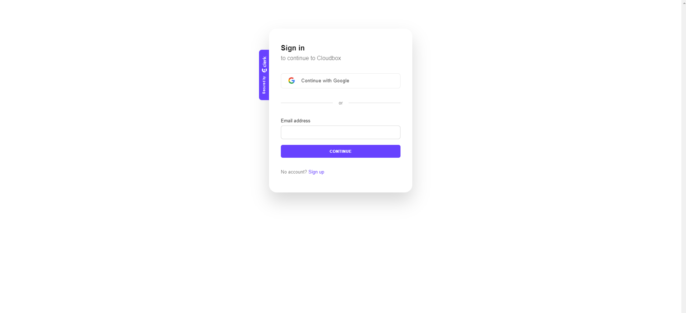
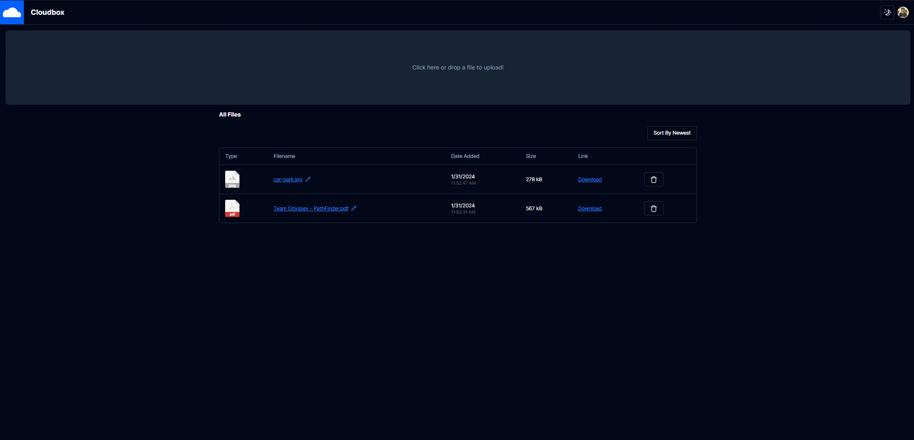
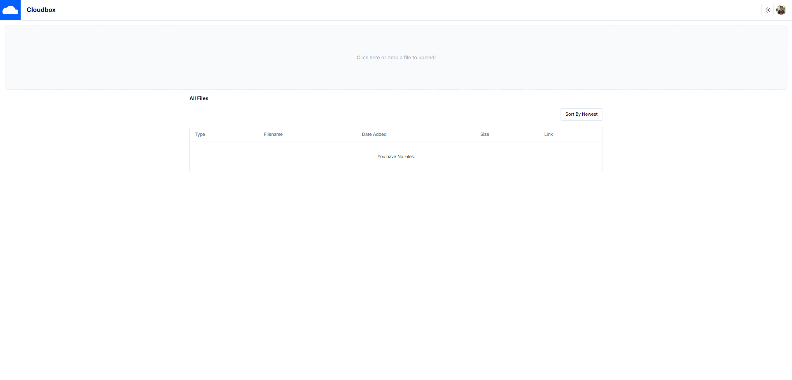
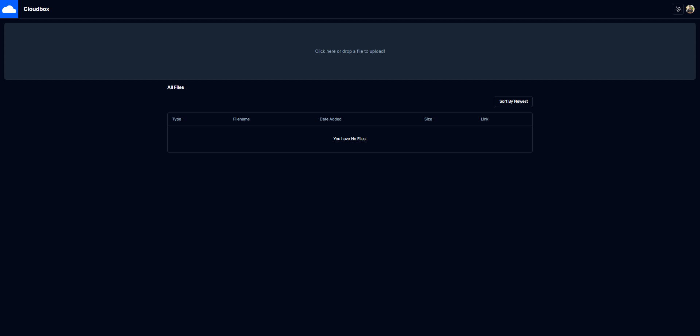
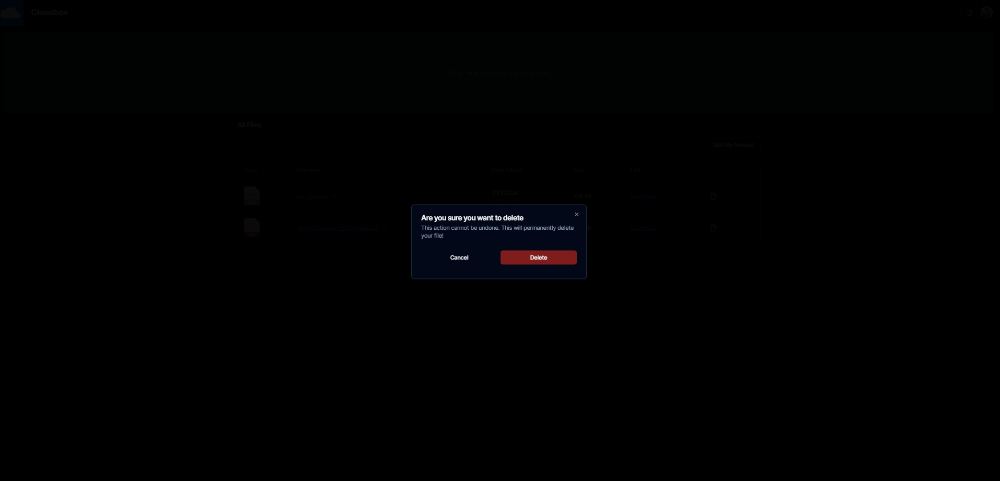
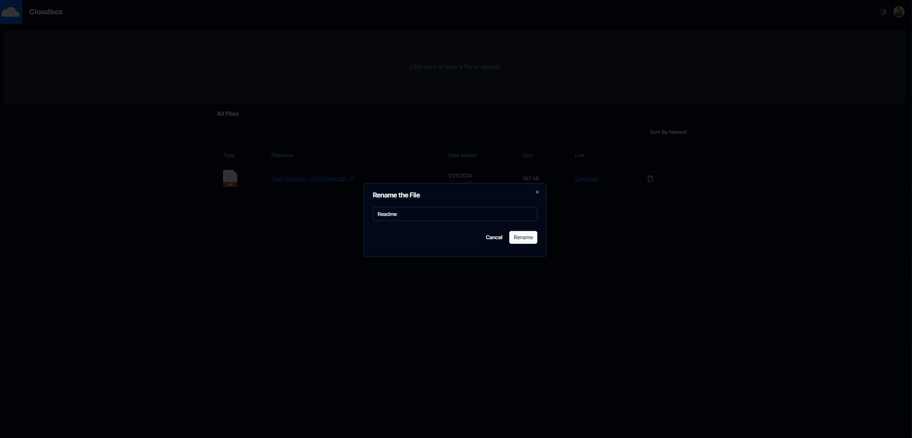

# ☁️ Cloudbox

Upload, organize, and access files from anywhere!

## ✨ Getting Started

1. Clone this project
2. Run `npm i` in the terminal to install all dependencies for your project.
3. Add your Firebase API key to the `apiKey` field in the `firebase.ts` file.
4. Create a `.env.local` file in the project directory and add the Clerk API key to it.
5. Finally, run `npm run dev` in your terminal to start the server.

## ⚙️ Tech Stack

1. React
2. Clerk
3. ShadCN
4. Firebase
5. Tailwind
6. TS

## 📸 Screenshots

### 🏠 Home Page

### 🔑 Authentication

### 💻 Dashboard

### 💡 Light/Dark Theme

<b>☀️ Light</b>

<b>🌕 Dark</b>

### 📰 Delete/Rename Files

<b>🗑️ Delete</b>

<b>✏️ Rename</b>

